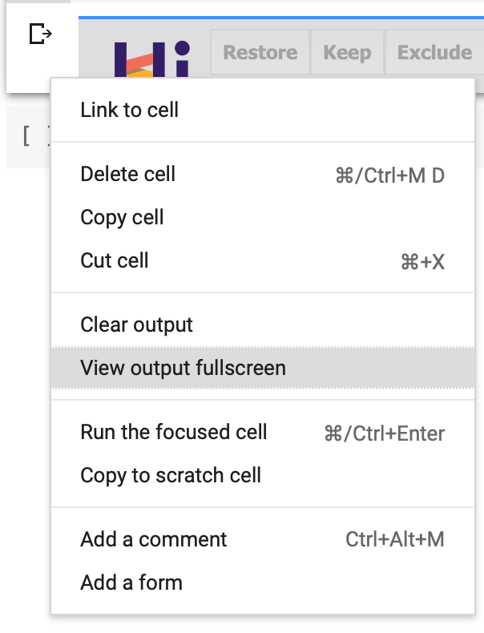

# AMES House Price Prediction Hyperparameter Search Viz

[Open in Google Colab 💻](https://colab.research.google.com/github/thomasjpfan/ames_housing_hiplot/blob/master/ames_hiplot.ipynb)

Based on ogrisel's [notebook](https://nbviewer.jupyter.org/github/ogrisel/notebooks/blob/master/sklearn_demos/ames_housing.ipynb#Interactions-between-hyperparameters-and-generalization) with a focus on using [hiplot](https://github.com/facebookresearch/hiplot) for visualizing the hyperparameter search. The search is shown in section [Model Selection: hyperparameter tuning](https://nbviewer.jupyter.org/github/ogrisel/notebooks/blob/master/sklearn_demos/ames_housing.ipynb#Model-selection:-hyperparameter-tuning) from the original notebook.

## Instructions

1. [Open in Google Colab 💻](https://colab.research.google.com/github/thomasjpfan/ames_housing_hiplot/blob/master/ames_hiplot.ipynb)
2. Run cells if they are not shown.
3. If you do not see the hiplot plot right click the left edge of the cell and select "View output full screen"

